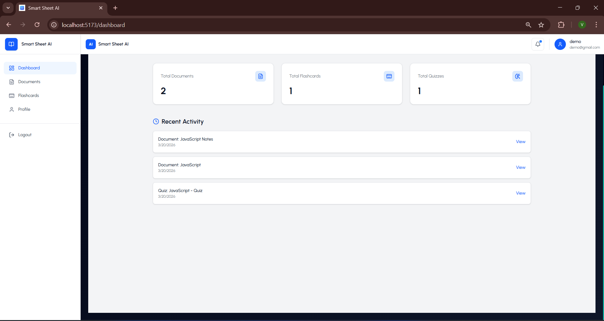
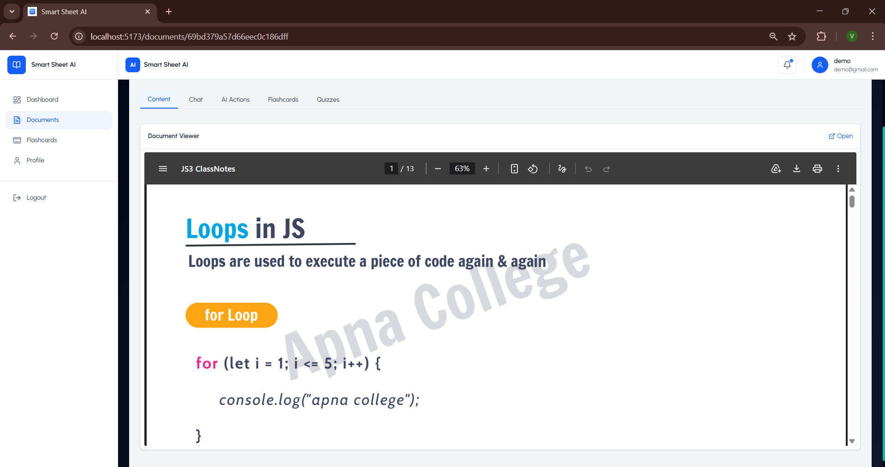
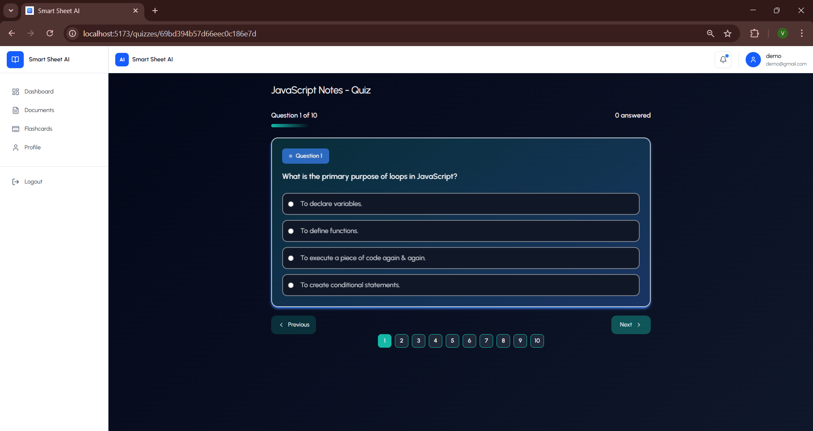
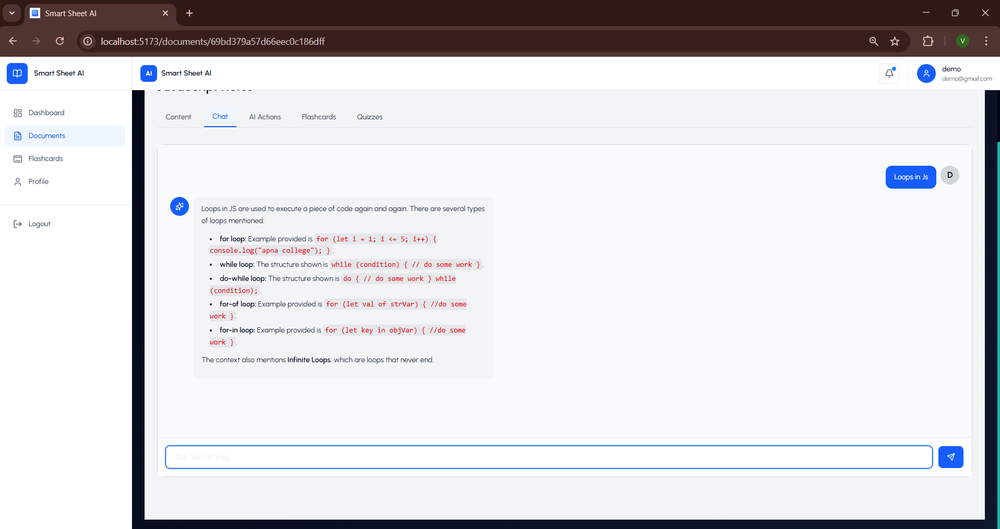
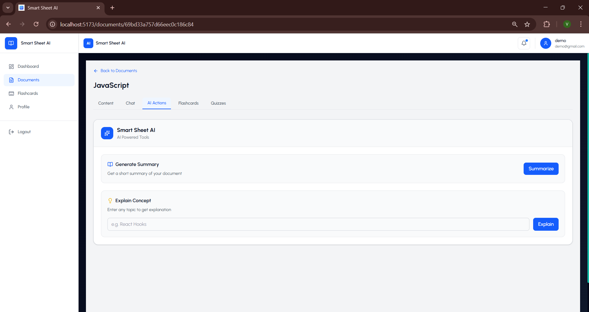
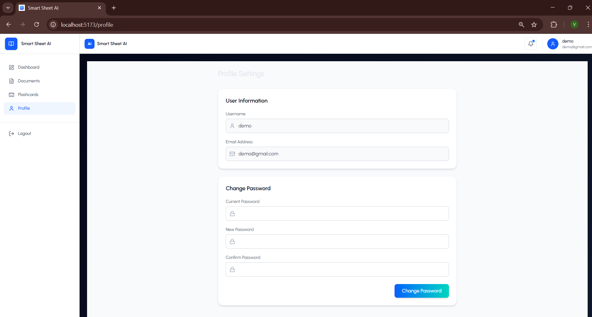

# SmartSheet AI

SmartSheet AI is an AI-powered learning platform that transforms uploaded PDF documents into structured learning materials, including quizzes, flashcards, summaries, and document-based Q&A.

Unlike generic AI note-taking tools, SmartSheet AI uses document-grounded AI generation to help users study from their own learning materials.

## Core Features

- **PDF Document Upload:** Upload and process PDF documents.
- **AI-Powered Learning Tools:**
  - Automatically generate quizzes.
  - Create flashcards with difficulty levels.
  - Generate concise summaries.
  - Explain concepts from uploaded documents.
- **Document-Aware Chat:**
  - Ask questions about uploaded documents.
  - Retrieve relevant document content to provide contextual answers.
- **Authentication:**
  - JWT-based authentication.
  - Protected routes and user-specific data.
- **User-Specific Data:**
  - Manage documents, quizzes, and flashcards associated with individual users.

## Key Capabilities

- **Cloud-Based Document Storage:** Uses ImageKit for document storage.
- **PDF Processing:** Extracts text and divides it into chunks for contextual AI processing.
- **Document-Grounded AI:** Generates learning content using relevant sections of uploaded documents.
- **Context-Aware Q&A:** Retrieves relevant document chunks to answer user questions.
- **Reusable Learning Materials:** Stores generated quizzes and flashcards for future use.

## System Architecture

SmartSheet AI follows a modular architecture with a separation of concerns.

- **Routes:** Define application endpoints.
- **Middleware:** Handles authentication, validation, and error handling.
- **Controllers:** Manage request handling and application logic.
- **Models:** Define MongoDB schemas.
- **Services:** Handle frontend API requests and AI-related operations.
- **Frontend:** Provides an interactive learning interface built with React.

## Tech Stack

**Frontend**
- React.js
- Redux Toolkit
- Tailwind CSS

**Backend**
- Node.js
- Express.js
- MongoDB
- Mongoose

**AI and Cloud**
- Google Gemini API
- ImageKit

**Tools**
- Git
- GitHub
- Docker

## Project Structure

```text
SmartSheet AI/
├── backend/
│   ├── config/
│   ├── controllers/
│   ├── middlewares/
│   ├── models/
│   ├── routes/
│   ├── utils/
│   ├── server.js
│   ├── package.json
│   └── Dockerfile
│
├── frontend/
│   ├── public/
│   ├── src/
│   │   ├── components/
│   │   ├── context/
│   │   ├── pages/
│   │   ├── services/
│   │   ├── utils/
│   │   ├── App.jsx
│   │   └── main.jsx
│   ├── package.json
│   └── vite.config.js
│
├── screenshots/
├── .gitignore
├── docker-compose.yml
├── package.json
└── README.md
```

## Installation and Setup

### Prerequisites

- Node.js and npm
- MongoDB (local installation or MongoDB Atlas)
- Google Gemini API key
- ImageKit account and credentials

### 1. Clone the Repository

```bash
git clone YOUR_GITHUB_REPOSITORY_URL
cd SmartSheet-AI
```

Replace `YOUR_GITHUB_REPOSITORY_URL` with your actual public GitHub repository URL after uploading.

### 2. Install Dependencies

**Backend**

```bash
cd backend
npm install
```

**Frontend**

Open a separate terminal from the project root:

```bash
cd frontend
npm install
```

### 3. Configure Environment Variables

Create a `.env` file in the backend directory using the provided `backend/.env.example` file.

Configure the required variables:

```env
NODE_ENV=development
PORT=3000
MONGO_URI=your_mongodb_connection_string
JWT_SECRET=your_jwt_secret
JWT_EXPIRE=your_token_expiry
MAX_FILE_SIZE=your_max_file_size
KIT_ENDPOINT=your_imagekit_endpoint
KIT_PUBLIC_KEY=your_imagekit_public_key
KIT_PRIVATE_KEY=your_imagekit_private_key
GEMINI_API_KEY=your_gemini_api_key
```

For the frontend, create a `.env` file using `frontend/.env.example` and configure the required variables.

Never upload real API keys, credentials, or `.env` files to GitHub.

### 4. Run the Application

**Start the backend**

```bash
cd backend
npm run dev
```

**Start the frontend**

In a separate terminal:

```bash
cd frontend
npm run dev
```

Open the local frontend URL shown in your terminal, usually:

```text
http://localhost:5173
```

The backend typically runs on port `3000`, depending on your configuration.

## Screenshots

### Dashboard



### Documents



### Flashcards


### Quiz



### AI Chat



### AI Actions



### Profile



## Environment Variables

| Variable | Description |
|---|---|
| `NODE_ENV` | Application environment |
| `PORT` | Backend server port |
| `MONGO_URI` | MongoDB connection string |
| `JWT_SECRET` | Secret used to sign JWTs |
| `JWT_EXPIRE` | JWT expiration duration |
| `MAX_FILE_SIZE` | Maximum allowed upload size |
| `KIT_ENDPOINT` | ImageKit endpoint |
| `KIT_PUBLIC_KEY` | ImageKit public key |
| `KIT_PRIVATE_KEY` | ImageKit private key |
| `GEMINI_API_KEY` | Google Gemini API key |
| `VITE_BACKEND_URL` | Backend API URL for the frontend |

## License

This project is licensed under the MIT License. See the `LICENSE` file for details if included in the repository.
